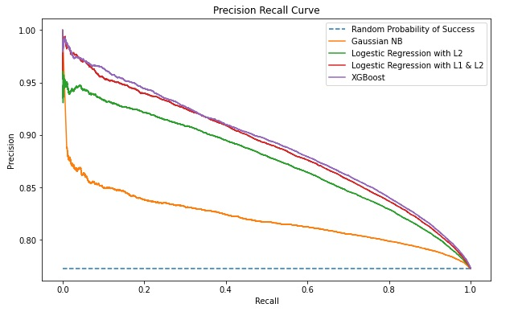

## Robo-Advisor For peer-to-peer lending

  

In February 2006, Prosper company started helping people borrow thousands of dollars online from strangers using a peer-to-peer lending system. Individual investors enjoyed the returns (historical return average 5.6%) from the lending, and borrowers enjoyed similar cost advantages compared with rates at a bank or credit union. Prosper alone facilitated $1.5 billion in Borrower Loan originations during 2020 and $18.2 billion in Borrower Loan originations since it first launched in 2006.

There are many loans on the peer-to-peer lending platform that inventors need to pick to put their money on, which is time-consuming and sometimes unclear which loan to pick. To address this issue, we start building a roboadviser that automatically evaluates loans and advises investors on which loan to put their money on.

To achieve that, we build a model from historical data and use it in roboadviser application to select high-quality loans to save investors time and maximize returns.

## Important files
[Basic EDA & Model Building](https://github.com/hbizunehe/LC-loan-prediction/blob/main/Model_Building.ipynb)

[Detail EDA](https://github.com/hbizunehe/LC-loan-prediction/blob/main/EDA_in_Detail.ipynb)

[Presentation Slides](https://github.com/hbizunehe/LC-loan-prediction/blob/main/Final_Presentation.pptx)

### Note
For missing data imputation, we used KNNImputer, which takes hours to complete. To make the running process easy, we stored the output of training, dev, and test data in the `data/imputed` directory, where the program detects the presence of the file and reads it after it does hash matching.

Ensure that the extra python files are present when you run the Notebook as it imports the functionalities.
